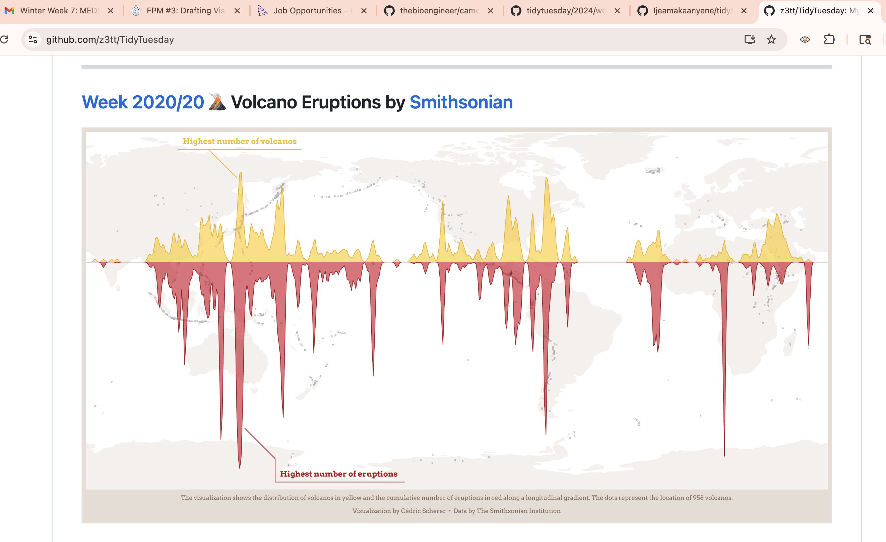
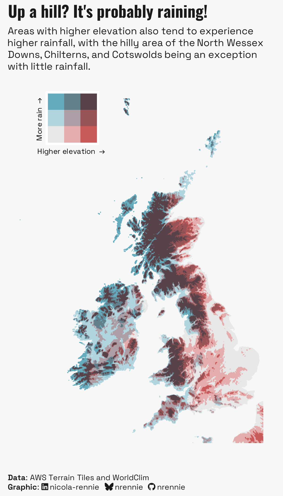
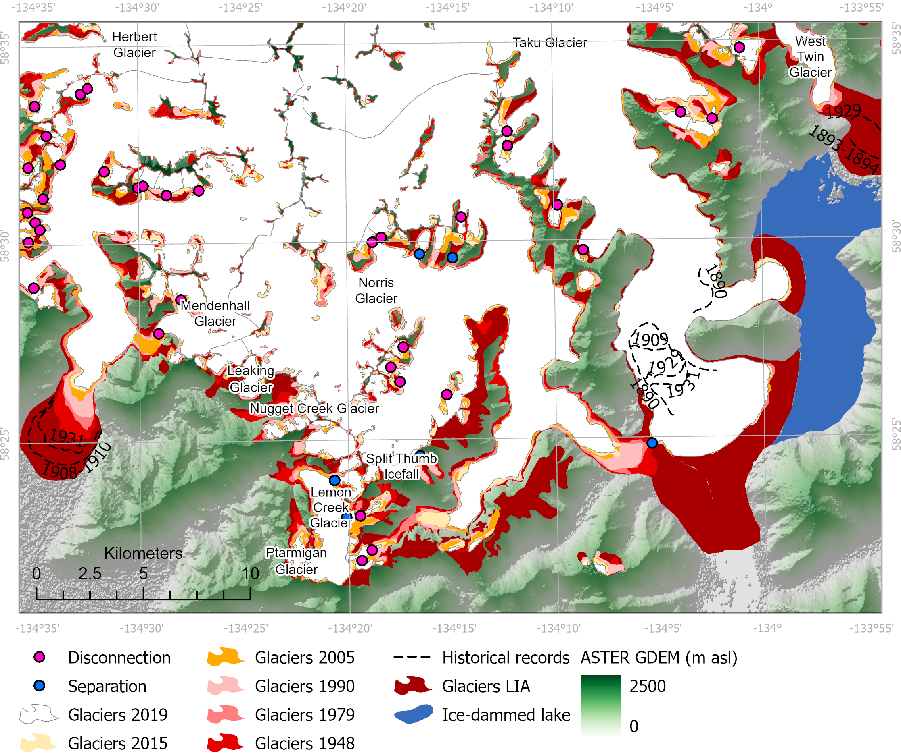
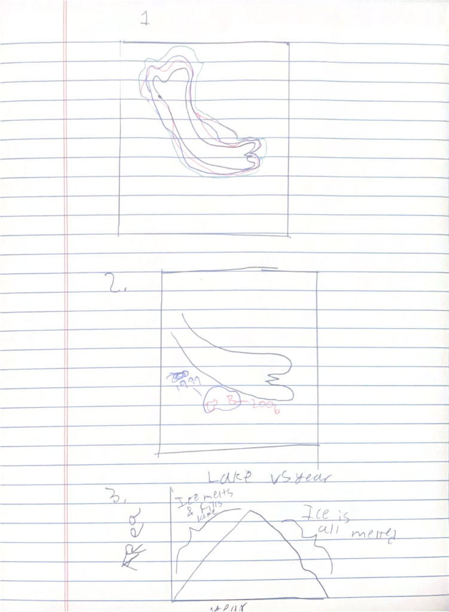

## I Question statement

*Can glacier decline be see in changing glacier lakes?*

-   Can glacier decline be plotted for the miage glacier?

-   Can glacier lake fragmentation be seen?

-   Can changes in glacier area be seen over time?

These questions have slightly changed as I have definitely zoomed in my analysis.

## II Data

I have three datasets. The first includes the shapefile of the glaciers in the region, which is the most current projection of the glacier I could find. The next includes glacier lake areas over \~70 years. It comes as a dataset for certain years, which I then join. The last dataset includes multilines for the glaciers between 1820 and 2005 as well as the glacier lakes in 2021 and 2005, so I can compare.

## III Inspiration Visuals

I am looking for different ways of presenting the recession so I found some visuals to help with those ideas.







## IV Hand Drawing




## V Recreate hand drawing

### Load packages

```{r}
pacman::p_load('tidyverse',
               'here',
               'ggthemes',
               'janitor',
               'terra',
               'tmap',
               'patchwork',
               'stars',
               'rnaturalearth',
               'showtext')
```

### Read data

#### Lakes

```{r}
lake_30 <- read_delim(here('data','VianiC_2018', 
                           'datasets', '1930s_glaciallakes.tab')) %>% 
  clean_names()

lake_70 <- read_delim(here('data','VianiC_2018', 
                           'datasets', '1970s_glaciallakes.tab'))%>% 
  clean_names()

lake_80 <- read_delim(here('data','VianiC_2018', 
                           'datasets', '1980s_glaciallakes.tab'))%>% 
  clean_names()

lake_90 <- read_delim(here('data','VianiC_2018', 
                           'datasets', '1990s_glaciallakes.tab'))%>% 
  clean_names()

lake_06 <- read_delim(here('data','VianiC_2018', 
                           'datasets', '2006_glaciallakes.tab'))%>% 
  clean_names()


lake_12 <- read_delim(here('data','VianiC_2018', 
                           'datasets', '2012_glaciallakes.tab'))%>% 
  clean_names()

lake_joined <- bind_rows(list(lake_30, lake_70, lake_80,
                           lake_06, lake_12))%>% 
  separate(event, into = c("lake", NA), sep = "_")%>% 
  filter(lake == 'Miage')
```

#### Aosta Portal 

```{r}
glacier_areas <- st_read(here::here('data',
                        'u1412_02-19-2026_20-16-06',
                        'ghiacciai_aree',
                        'ghiacciai_aree.shp'))

miage_glacier <- glacier_areas %>% 
  filter(nome == 'GLACIER DU MIAGE')

miage_label <- miage_glacier[1,]

glacier_lakes <- st_read(here::here('data',
                        'u1412_02-19-2026_20-16-06',
                  'ghiacciai_laghi_epiglaciali',
                        'ghiacciai_laghi_epiglaciali.shp'))

miage <- glacier_lakes %>% 
  filter(grepl("Miage", nome_lago)) %>% 
  mutate(anno_rilie = as.integer(as.character(anno_rilie)))

glacier_lakes_2021 <- st_read(here::here('data',
                        'u1412_02-19-2026_20-16-06',
                  'ghiacciai_laghi_epiglaciali_2021',
               'ghiacciai_laghi_epiglaciali_2021.shp'))

miage_2021 <- glacier_lakes_2021 %>% 
  filter(grepl("MIAGE", nome)) %>% 
  mutate(anno_rilie = 2021)

glacier_permimeter <- st_read(here::here('data',
                        'u1412_02-19-2026_20-16-06',
                  'ghiacciai_perimetri',
               'ghiacciai_perimetri.shp'))

miage_perimeter <- glacier_permimeter %>% 
  filter(grepl("MIAGE", nome_gs)) %>% 
  mutate(anno = as.character(anno))


```

### Plots

#### 1: Plot of whole glacier area

```{r}

tm_layout(inner.margins = c(0.15, 0, 0, 0)) +
tm_tiles(c(CartoDB = "CartoDB.PositronOnlyLabels")) +
tm_shape(miage_perimeter) +
  tm_lines(
    col = 'anno',
    col.scale = tm_scale_ordinal(values = 'brewer.blues'),  
    col.legend = tm_legend(
      title = 'Year',
      labels.format = list(big.mark = ''),
      orientation = 'landscape',
      position = c(0, .1),
      bg.color = '#876D4D'
    ),
    col_alpha = 'anno',
col_alpha.scale = tm_scale_ordinal(values = seq(.4, 1, length.out = 8)),
    lwd = 'anno',
    lwd.scale = tm_scale_ordinal(values = seq(8, 1, length.out = 8)),# adjust 8 to number of years
  lwd.legend = tm_legend(show = FALSE),
col_alpha.legend = tm_legend(show = FALSE)
  ) +
tm_shape(miage_label) +
  tm_text(
    text = 'nome', col = 'black',
    xmod = -.9, ymod = -3.2, angle = -45, size = .7
  ) +
tm_compass(type = "4star", size = 2, position = c("right", "top"))
  
tmap_save(filename = 'MAP.pdf')

bbox_wgs84 <- st_bbox(c(xmin = 6.749, xmax = 7.012, ymin = 45.719, ymax = 45.893), 
                       crs = 4326)

tm_basemap(paste0("https://tiles.stadiamaps.com/tiles/stamen_terrain/{z}/{x}/{y}.png?api_key=9f50ab24-f2dd-4c8d-a6e6-cd961ab3a7da")) +
tm_tiles("CartoDB.PositronOnlyLabels") +
  tm_shape(st_as_sfc(bbox_wgs84)) +
  tm_borders(col = NA) +
  tm_layout(frame = FALSE)

tmap_save(filename = 'basemap.png', dpi = 600, width = 6, height = 6)
```

#### 2: Plot of miage lake

```{r}
miage <- miage %>% 
  filter(anno_rilie == '1999')

miage_2021 <-  miage_2021 %>% 
  filter(!nome %in% c('MIAGE I', 
                     'MIAGE II',
                     'MIAGE III',
                     'MIAGE IV',
                     'MIAGE V'))


miage_map <- tm_shape(miage_2021)+
tm_layout(bg.color = '#876D4D',
          outer.bg.color = '#876D4D', # This is essentially cobolt style but works with the legend I add 
          frame.color = NA,
          frame.lwd = 0)+
tm_shape(miage) + # Add lake in 2006 and 1999
  tm_polygons(fill = 'anno_rilie',
              fill.scale = tm_scale_categorical(values = c('lightblue', 'lightblue')),
               fill.legend = tm_legend(show = FALSE))+
   tm_tiles(c(CartoDB = "CartoDB.PositronOnlyLabels"))+
  tm_shape(miage_glacier)+ # Add the glacier
  tm_polygons(fill = 'white',
              col = '#08316B',
              lwd = 3)+
  tm_shape(miage_2021)+ # add 2021 lake
  tm_polygons(fill = 'anno_rilie',
              fill.scale = tm_scale_categorical(
                values = 'red'),
              fill.legend = tm_legend(show = FALSE))+
  # Add a legend so we can include the 2 different sets
tm_add_legend(type = 'polygons', 
              labels = c('1999', '2021'), 
              fill = c('lightblue', 'red'),
               bg.color = "#876D4D",
              text.color = 'white',
              title.color = 'white',
              frame.color = NA,
              frame.lwd = 2,
              title = 'Year')

tmap_save(filename = 'MIAGE_MAP.pdf', miage_map)  
```

#### 3: Plot of miage area over time

```{r}
# Add fonts
font_add_google(name = 'Quicksand',  # Quicksand for title
                family = 'quicksand')

font_add_google(name = 'Fira Sans Condensed', # Fire sans for non-title
                family = 'fira_sans_condensed')

# Grab years for x-axis
years <- lake_joined %>% 
  filter(grepl("Miage", lake)) %>% 
  pull(date_time) %>% 
  unique()

miage_area <- lake_joined %>% 
  filter(grepl("Miage", lake)) %>% 
  group_by(date_time) %>% 
  summarize(total_area = (sum(area_m_2, na.rm = TRUE))) %>% 
  ggplot(aes(x = date_time, y = total_area)) +
  geom_line(color = '#68452E',
            lwd = 3)+
  geom_point(size = 4)+
  scale_x_continuous(breaks = years)+
  scale_y_continuous(labels = scales::comma)+
  labs(
    x = 'Year',
    y = 'Area (Meters<sup>2</sup>)'
  )+
  theme_tufte()+
  theme(
        plot.background = element_rect(fill = '#048F7A'), # Cobalt 
        axis.title =  ggtext::element_markdown(color = 'black',
                                  family = 'fira_sans_condensed',
                                  size = 20),
        axis.title.y = ggtext::element_markdown(),
        axis.text = element_text(color = 'black',
                                 family = 'fira_sans_condensed',
                                 size = 12),
        plot.title = element_text(color = 'black',
                                  family = 'quicksand'),
        axis.line = element_line(color = "black", size = 1)
        )

showtext.auto(enable = TRUE)
miage_area

ggsave(filename = 'AREA.pdf', width = 1500, 
       height = 1000, units = 'px')
showtext.auto(enable = FALSE)


```
## VI. Answer a few last questions about your work and progress
1. What are the key insights you want your infographic to communicate, and how will your design choices help highlight and support those messages?

I want 3 things to be clear: 

-  Glacier is receding: I think this is clear but I might look in other ways of showing it to make it clearer

-  Glacier lake is fragmenting: This is the most clear as the red lakes are hard to miss, and show that as the glacier melts new lakes form 

-  Glacier lake area is quickly reducing: Very clear from the plot 

2. What challenges did you encounter or anticipate encountering as you continue to build / iterate on your visualizations in R? If you struggled with mocking up any of your three visualizations, describe those challenges here.

I struggled most with actually getting my data. Once I had it I had to pray it had what I needed and it did! I was most worried about the glacier recession plot, and I still am struggling to know if the aesthetics are clear. 

3. What ggplot extension tools / packages do you need to use to build your visualizations? Are there any that we haven’t covered in class that you’ll be learning how to use for your visualizations?

I currently am using tmap heavily. I may want to migrate these to ggplot, but I have more experience in tmap. The thing that I am struggling to find is whether I can import google fonts for the tmap plots as well. 

4. What feedback do you need from the instructional team and / or your peers to ensure that your intended message and key insights are clear?

I would like to know if it is visible that there has been glacier recession in my first plot. I also noticed that if I plot perimeters instead of areas in the third plot I get an increasing line. What could I do to plot these lines on top of eachother to further show fragmentation.

Begin by reviewing the feedback you received on FPM #3 from your instructional team and from your in-lab peer reviews. Make a short plan describing what specific changes you intend to make based on that feedback. Respond to the following in an issue titled, FPM4 - reviewing feedback
